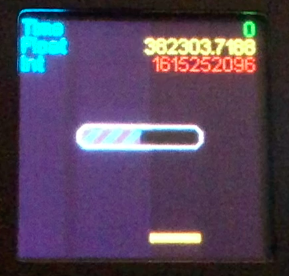

# windows

A librayr to help you present data nicely on a small OLED or LCD screen

## Work in project

This is a small project that can help you have a nice display with a top and a bottom bar, alerts, fields and more, on a small OLED or LCD display.

## Examples

Please check windows.ino in the `examples` folder.

## Documentation

Documentation will come as soon as possible.

## Screenshots, videos

